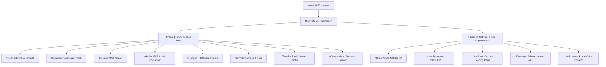

# 🎬 NIOXON Server Provisioning CLI

NIOXON is an automated provisioning system and command-line interface designed to set up, secure, and deploy a plug-and-play **local offline media streaming box**. It configures a captive network environment that serves media streaming applications without requiring an active internet connection.

---

## 🏗️ Architecture & Features

This tool builds a production-grade, hardened Linux server architecture divided into two main deployment phases:



### 1. Core Services Setup (Phase 1)
* **Firewall Security (UFW)**: Locks down all ports by default, allowing only SSH (`22`), HTTP (`80`), and HTTPS (`443`), while restricting DNS (`53`) and DHCP (`67/68`) explicitly to the local LAN interface.
* **Modern PHP 8.3**: Installs PHP 8.3 via the Ondřej Surý PPA, including all crucial extensions (`mysql`, `redis`, `sqlite3`, `gd`, `bcmath`, `fpm`, `cli`), and configures high post/upload limits (`10GB`) to allow uploading large local video files.
* **Database & Memory Engines**: Installs MySQL Server and Redis Cache.
* **Node.js & PM2**: Installs Node.js 20 and PM2 global package manager.
* **Supervisor**: Installs Supervisor daemon for system-level background queue management.

### 2. Network & Redirection Setup (Phase 2)
* **Static LAN Netplan**: Sets up static IP allocation on your Ethernet/Wi-Fi interface (`NetworkManager` renderer).
* **Captive DNS & DHCP (Dnsmasq)**:
  * Runs a wildcard DNS server that maps all web requests to the local server IP.
  * Optionally runs a local DHCP server allocating client IP pools (`192.168.1.50` to `192.168.1.150` on `/24` subnets) to connect devices automatically.
* **Captive Landing Page (Nginx)**: Generates a premium, dark-themed, glassmorphic captive portal interface in `/var/www/captive/index.html` featuring Google Fonts (`Outfit`), radial glowing borders, and seamless redirect buttons.

### 3. Application Deployment (Phase 2)
* **Laravel Backend API (NioxPlay OTT API)**:
  * Clones the repository (`https://github.com/nioxon/nioxplay-app-ott-api`) using a GitHub Personal Access Token (for private repos).
  * Automatically generates a secure random password for a dedicated `nioxplay` database user.
  * Runs composer dependency installs, key generations, and database migrations.
  * Hosts the API under Nginx on `api.domain` and `ott-api.test`.
  * Monitored by Supervisor workers (`ott-api-worker`) for handling background queues.
* **Vite Vue Frontend (Niox Play)**:
  * Clones the frontend repository (`https://github.com/nioxon/niox-play`).
  * Runs `npm install` and compiles static assets using `npm run build`.
  * Hosts the compiled files under Nginx on the main website domain.

---

## ⚙️ Configuration Variables

When running `nioxon configure`, the system will first ask:
> Use default configuration values? (y/n) [y]:

If you choose **yes** (`y` or Enter), the CLI will skip all customization questions, automatically set the source type to `git` pointing to the default repositories, and prompt you **only** for your GitHub Personal Access Token (PAT).

If you choose **no** (`n`), the system will prompt you to customize each of the variables below:

These values are saved inside `/opt/nioxon/config/runtime.env`:

| Variable | Prompt | Default | Description |
| :--- | :--- | :--- | :--- |
| `PROJECT_NAME` | Project name | `nioxon` | The project slug name used in configurations. |
| `SITE_DOMAIN` | Domain | `nioxplay.local` | The domain name used to access the streaming web app. |
| `LAN_IFACE` | LAN interface | Auto-detected | The network interface (Ethernet/Wi-Fi) serving the local network. |
| `LAN_IP` | LAN IP | `192.168.1.2` | The static IP address of this server on the local network. |
| `LAN_NETMASK` | LAN subnet | `24` | The subnet mask bits (e.g. `24` representing `/24`). |
| `ENABLE_DHCP` | Enable local DHCP server? | `true` | Whether the server should assign IP addresses to connecting clients. |
| `APP_SOURCE_TYPE` | App deployment source | `usb` | Where to fetch the apps from: `usb`, `git`, or `local`. |
| `API_SOURCE_VALUE` | API Git / Path | `nioxplay-app-ott-api` | URL of the API repository, local path, or zip name on USB. |
| `FRONTEND_SOURCE_VALUE` | Frontend Git / Path | `niox-play` | URL of the Frontend repository, local path, or zip name on USB. |
| `GITHUB_PAT` | GitHub Access Token | *(hidden)* | Personal Access Token used to clone private repositories. |

---

## 🚀 How to Install and Run

### 1. Core Installation
To install the NIOXON CLI launcher onto the machine:

#### **A. Developer Local Mode (Testing changes locally)**
If you are running from inside the cloned repository directory:
```bash
sudo ./install.sh
```
*The installer automatically detects local files and copies them to `/opt/nioxon` instead of fetching from GitHub.*

#### **B. Production Mode (Target Server)**
Download and run the installer via terminal:
```bash
curl -fsSL https://raw.githubusercontent.com/nioxon/provision/main/install.sh | sudo bash
```

### 2. Provisioning Commands

Once the CLI is installed, manage the provisioning using the global `nioxon` command:

* **Setup (Full installation: configures + installs)**
  ```bash
  sudo nioxon setup
  ```
  *Note: If the setup fails, running this again will resume from the last successful step. Add `--force` or `-f` to start clean.*
  ```bash
  sudo nioxon setup --force
  ```

* **Configure (Configures settings without running installation)**
  ```bash
  sudo nioxon configure
  ```

* **Install (Runs installation steps using existing `runtime.env` config)**
  ```bash
  sudo nioxon install
  ```

---

## 🧪 Local Mock Testing Harness (macOS / Linux Safe)

For local developers on macOS, you cannot run actual Debian-based commands (like `apt-get` or `systemctl`). 

To verify the logical execution, environment configurations, and generated file structures safely on your developer machine, run the local mock script:
```bash
./test_mock.sh
```
This script:
1. Creates local mock binaries of Linux commands inside `/tmp/nioxon_mock_test/bin` and adds them to `PATH`.
2. Intercepts `curl` requests targeting installer scripts (e.g. NodeSource, Composer) to simulate successful installs.
3. Sets up a mock target tree and performs the configuration prompts.
4. Executes the full provisioning pipeline and outputs the resulting generated configuration files (Netplan, Dnsmasq, Nginx, Supervisor configurations) for visual verification.
5. Exit code `0` is returned on success.
