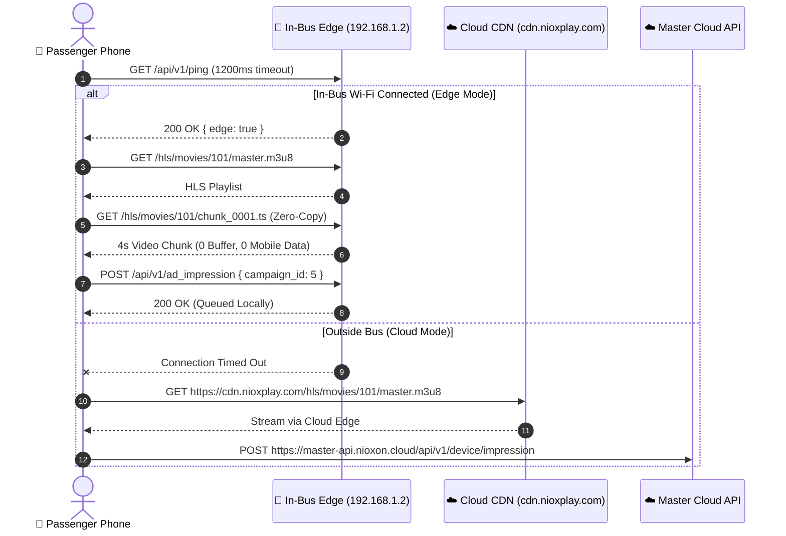

# In-Bus Edge Hardware Node Server - Edge-Cloud Sync & Zero-Buffering Streaming Architecture

## 1. Local Server Stack & Zero-Buffering CDN
- **OS**: Ubuntu Server 22.04/24.04 LTS (Provisioned via `nioxon setup`).
- **DNS / DHCP**: Dnsmasq (Captive portal wildcard redirection to `192.168.1.2`).
- **Web Server & Local CDN Engine**: Nginx with Kernel Zero-Copy Direct I/O (`sendfile`, `tcp_nopush`, `tcp_nodelay`, `aio threads;`, `directio 8m;`).
- **HLS Chunk Architecture**:
  - Segment Length: **3 to 4-second `.ts` chunks** with byte-range HTTP 206 Partial Content support.
  - Playlist Caching (`.m3u8`): `Cache-Control: no-cache, no-store, must-revalidate` (ensures real-time playlist availability).
  - Chunk Caching (`.ts`, `.m4s`): `Cache-Control: public, max-age=31536000, immutable` (cached locally on passenger phones for instant zero-load replay).
  - Open File Descriptors: `open_file_cache max=10000 inactive=1d;` prevents filesystem bottlenecks across 60+ simultaneous passengers.
- **Media Storage**: NVMe SSD mounted at `/opt/nioxon/media/hls`.
- **HLS Packager CLI**: `niox-hls-packager <input.mp4> <output_dir> [chunk_sec]` (Automates 4-second keyframe GOP chunking via FFmpeg).
- **Offline Impression Storage**: Local SQLite/MySQL database for buffering proof-of-play records.
- **Sync Daemon**: Background service syncing with Cloud Master API (`https://master-api.nioxon.cloud`).

---

## 2. Bidirectional Edge-Cloud Synchronization Protocol

### A. Upstream Proof-of-Play Sync (`POST /api/v1/device/sync`)
When the bus arrives at a terminal/depot with Wi-Fi or enters a cellular 4G/5G coverage zone:
1. `SyncService` gathers all offline ad impression records from local `ad_logs` where `is_synced = false`.
2. Packages records into a batch payload with a unique `batch_uuid`.
3. Dispatches via HTTPS to Master Cloud API (`https://master-api.nioxon.cloud/api/v1/device/sync`).
4. Master API deduplicates by `batch_uuid`, updates creator revenue shares (70% creator / 30% platform), charges advertiser budgets, and returns `200 OK`.
5. Local node marks records as `is_synced = true`.

### B. Downstream Ad & Content Sync (`POST /api/v1/device/pull`)
1. Dispatches node credentials (`X-Device-UID`, `X-Device-Secret`) and route ID to Master Cloud API.
2. Cloud API returns active ad campaigns specifically targeted to that route/corridor (e.g. `Patna ⇄ Delhi NCR`).
3. Downloads missing video `.mp4` and `.m3u8` packages from Cloud CDN (`https://cdn.nioxplay.com`) with resume support (`curl -C -`).
4. Auto-packages MP4 files into 4-second HLS chunks in `/opt/nioxon/media/hls/`.
5. Updates local catalog tables (`campaigns`, `creatives`, `movies`, `shows`, `masala`, `creator_contents`).

---

## 3. Passenger Hybrid App (`nioxplayapp`) Playback Flow

